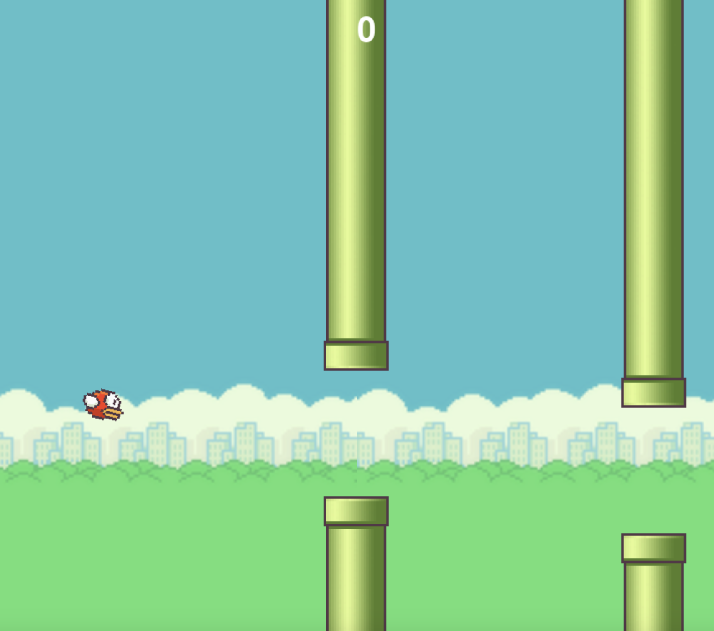

# Flappy Bird Game

A simple Flappy Bird game built using Python and Pygame.

## Features
- Gravity-based bird movement.
- Pipes randomly generated for obstacles.
- Score tracking.
- Restart functionality.
- Simple and intuitive controls.

## How to Play
- Click the left mouse button to make the bird jump.
- Avoid hitting the pipes and the ground.
- Pass through the gaps between pipes to score points.

## Prerequisites
Ensure you have Python installed on your system. Then, install Pygame:

```bash
pip install pygame
```

## Installation
1. Clone this repository or download the ZIP file.
2. Place the necessary image assets in an `img` folder inside the project directory:
   - `bg.png`: Background image.
   - `ground.png`: Ground image.
   - `bird1.png`, `bird2.png`, `bird3.png`: Bird animation frames.
   - `pipe.png`: Pipe image.
   - `restart.png`: Restart button image.
3. Run the `main.py` file to start the game:

```bash
python main.py
```

## Code Explanation

### Game Components
1. **Bird**: A class that defines the bird's behavior, including jumping, falling due to gravity, and animation.
2. **Pipe**: A class to handle pipes as obstacles. Pipes are generated at random heights and scroll across the screen.
3. **Button**: A class to handle the restart button functionality.

### Game Loop
- The game loop handles drawing the background, pipes, bird, and ground.
- It also checks for collisions and updates the score.
- If the game ends, a restart button is displayed.

### Reset Functionality
The `reset_game` function clears the pipes, repositions the bird, and resets the score.

## Screenshots


---

Enjoy playing Flappy Bird! 🚀